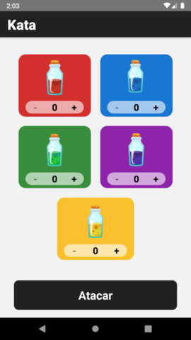
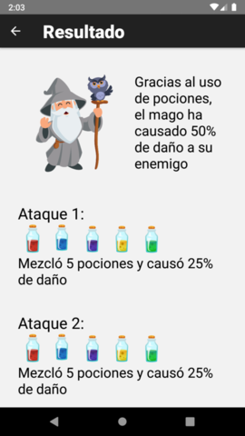

<h1 align="center">
  <a href="/">
    Magic potions
  </a>
</h1>

  <strong>Help the wizard to attack his enemy by providing potions</strong> 

## Download

- You can download the app for android here
https://drive.google.com/file/d/1SiS872bwX8dg8bpnLVX8QfaRQVzWVtAX/view?usp=sharing

## Captures

 
 

## Step by step

- Environtment setup: 
 
https://reactnative.dev/docs/environment-setup
- Clone the repository: 
 
`git clone https://github.com/AlexisFabianCarranza/react-native-ts-magic-potions.git`
- Install dependencies: 
 
`yarn`
- Run project: 
`npm run android`
`npm run ios`
- Run test:
`yarn test`
